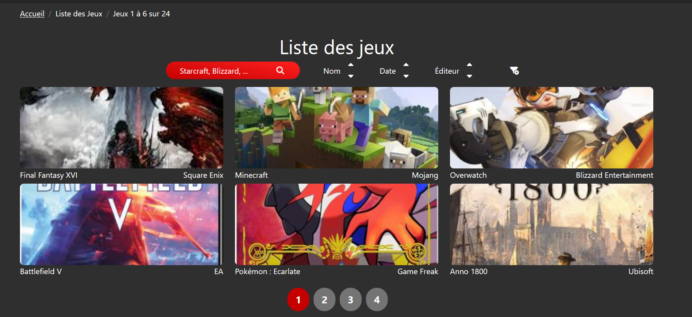
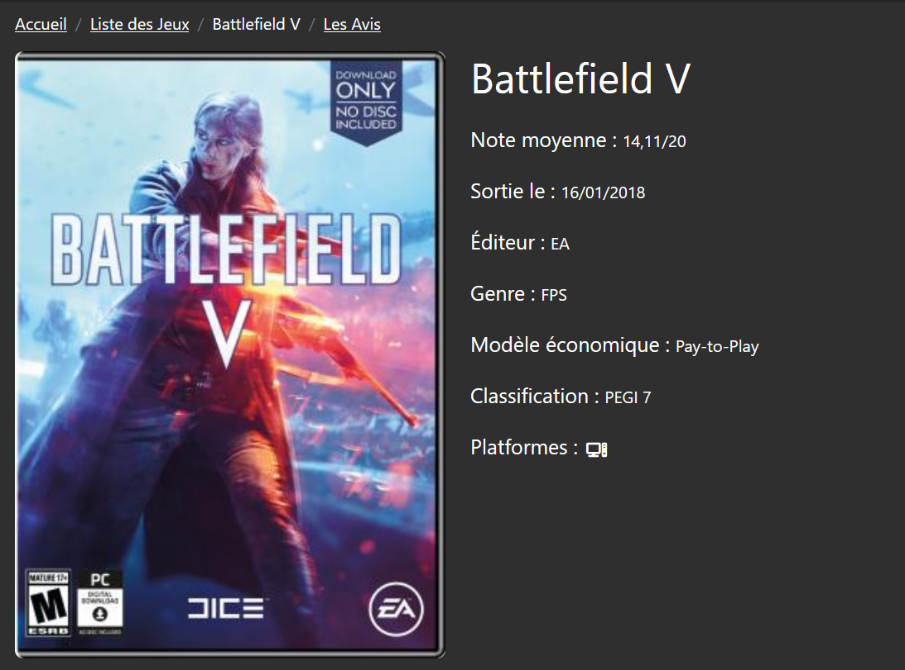
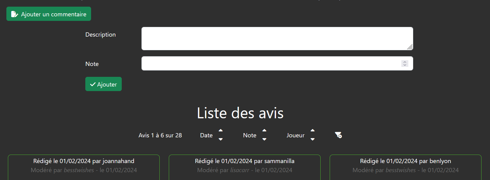
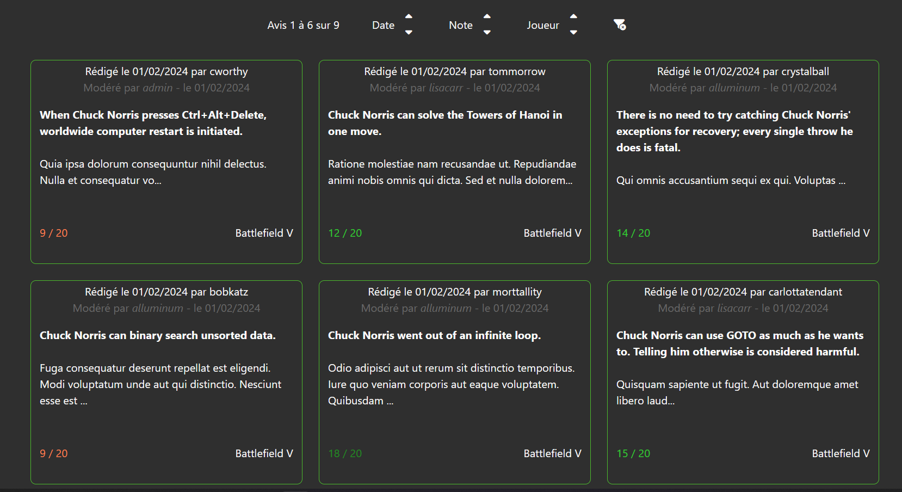

Durant la formation Développeur Java Spring Boot proposé par Human Booster, nous avions sur la fin de celle ci un mini-projet, d'un dizaine de jours, d'application web d'inventaire de jeux vidéos et de commentaires que des utilisateurs peuvent déposer sur les jeux.

Les fonctionnalités présentes sur l'application pour un utilisateur est de pouvoir parcourir la liste des avis et des jeux, de pouvoir consulter la pages de détails d'un jeu et de déposer un commentaire.
Le modérateur peut accepter ou refuser un commentaire, ajouter des jeux et éditeurs et modifier un jeu.

Les listes des avis peut être triés par date de publication, note et "joueur", c'est-à-dire l'utilisateur qui a publié le commentaire, ou bien être filtrés par jeu ou joueur, le modérateur peut également filtrés les commentaire à modérer ou ceux déjà modéré.

La liste de jeux peut être triés par nom de jeu, nom d'éditeur et par date de sortie, ou bien être filtrés par une chaine de caractéres correspondant à un nom de genre, un nom d'éditeur, un nom de jeu, un modéle économique ou une classification.

Voici ma réalisation, avec le code disponible et quelques captures d'écrans pour pouvoir voir le visuel proposé.

